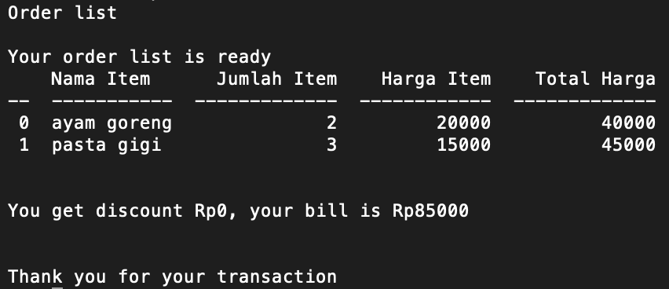

# Guide to Use Super Cashier Apps

## Before the Transaction Journey

### Install Tabulate and Datetime Library

This module require tabulate and datetime library. Datetime is used for generate time of the transaction.
Tabulate is used for make table of order list. Make sure you install both library before use it.

## Transaction Journey

### 1. Instances a Transaction Object

You must instance a Transaction Object in each transaction.

<h4>For example:</h4>
<pre>
    <code>t1 = Transaction() 
     t2 = Transaction() 
     t3 = Transaction() </code> 
</pre>
There are 3 transaction happen.

### 2. Adding Item to Your Order List

You need to input item name, item quantity, and item price per quantity when you want to add an item in order list. You can input all of them by using this method:
 `add_item(item name, item quantyty, item price per quantity)`

<h4>For example:</h4>
<pre>
    <code>t1.add_item('Ayam Goreng', 2, 30000) 
     t1.add_item('Pasta Gigi', 3, 15000)  </code> 
</pre>
You add two Ayam Goreng at price 30000 per head and three Pasta Gigi at price 15000 per item on order list of transaction 1.

### 3. Check all Item in Order List

After you add all items to order list, you can check your order list using method `check_order()`.
 It will give you order list like this:
 
 

### 4. Check Your Bill

If your order list is correct and you want to see your bill, you can use method `total_price()`.
Your bill is the total price minus the discount if you satishfied the condition.
These are the discount conditions:
 1.You get 5% discount when total pay is between Rp200.000,00 and Rp300.000,00.
 2.You get 8% total pay is between Rp300.000,00 and Rp500.000,00.
 3.You get 10% when total pay is above Rp500.000,00
 
 

## Update Your Transaction

### 1. Change Name of Item

You can change your item name without change its quantity and price per item.
  You can use method `update_item_name(item name,update item name)`

<h4>For example:</h4>
<pre>
    <code>t1.add_item('Ayam Goreng', 2, 30000) 
     t1.update_item_name('Ayam Goreng', 'Ayam Bakar')  </code> 
</pre>
You change item name of Ayam Goreng become Ayam Bakar. Quantity and price per item will be same.

### 2. Update Quantity of Item

You can update your quantity of an item without change its name and price per item.
  You can use method `update_item_qty(item name,update item quantity)`

<h4>For example:</h4>
<pre>
    <code>t1.add_item('Ayam Goreng', 2, 30000) 
     t1.update_item_qty('Ayam Goreng', 4)  </code> 
</pre>
You update quantity of Ayam Goreng become 4.

### 3. Update Price per Item of Item

You can update your price per item of an item without change its name and quantity.
  You can use method `update_item_price(item_name,update item price)`

<h4>For example:</h4>
<pre>
    <code>t1.add_item('Ayam Goreng', 2, 30000) 
     t1.update_item_price('Ayam Goreng', 25000)  </code> 
</pre>
You update price per item of Ayam Goreng become 25000.

### 4. Delete an Item

You delete an item in your order list by using method `delete_item(item name)` .

<h4>For example:</h4>
<pre>
    <code>t1.add_item('Ayam Goreng', 2, 30000) 
     t1.add_item('Pasta Gigi', 3, 10000) 
     t1.delete_item('Pasta Gigi')  </code> 
</pre>
You delete Pasta Gigi from your order list.

### 5. Reset Transaction

You can remove all item in order list by reset the transaction.
 You can use method `reset_transaction()`

<h4>For example:</h4>
<pre>
    <code>t1.add_item('Ayam Goreng', 2, 30000) 
     t1.add_item('Pasta Gigi', 3, 10000) 
     t1.reset_transaction() </code> 
</pre>
All of item in transaction 1 is removed.
 
 
Please see the [References](reference.md) for further details.
